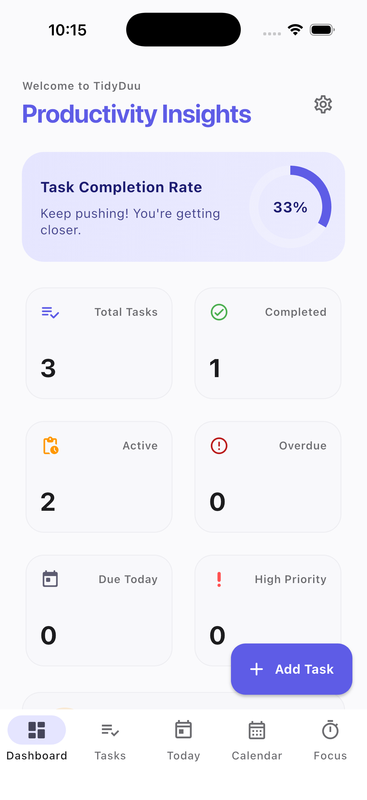
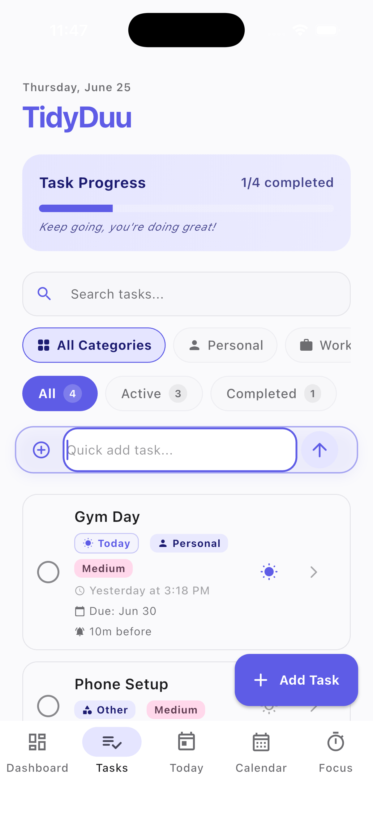
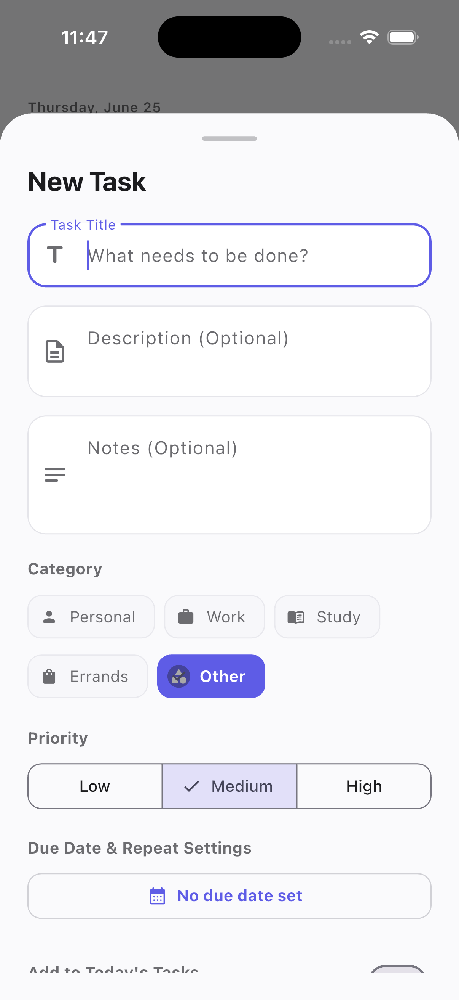
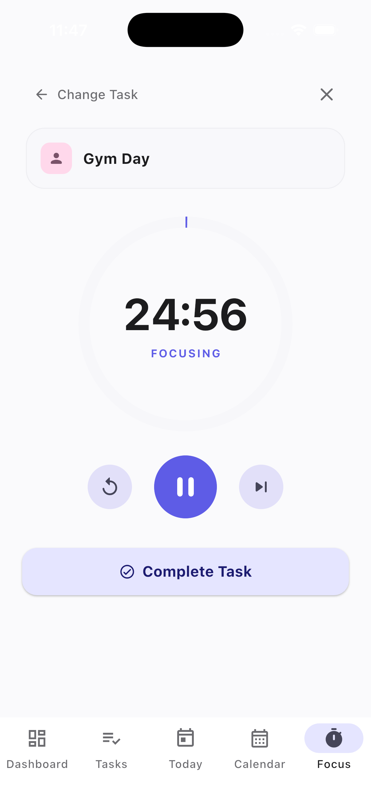
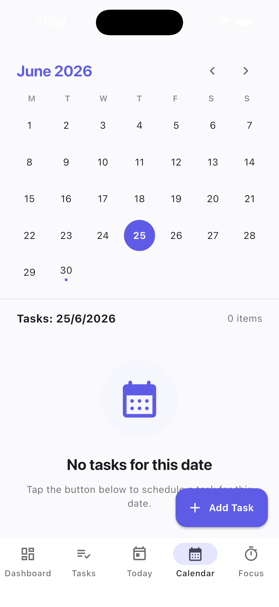
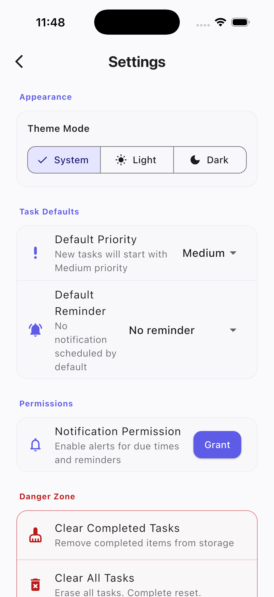
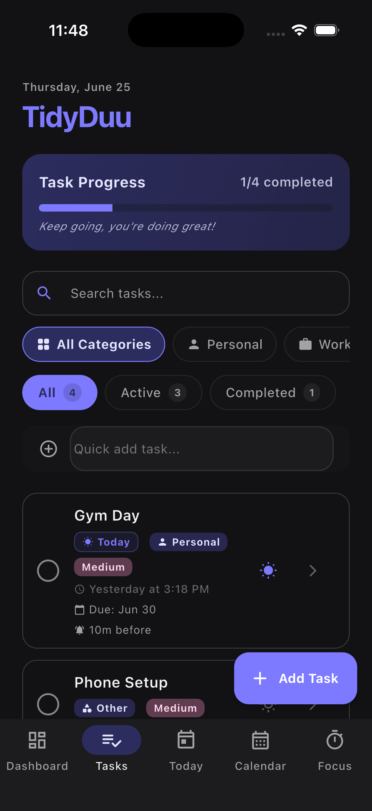
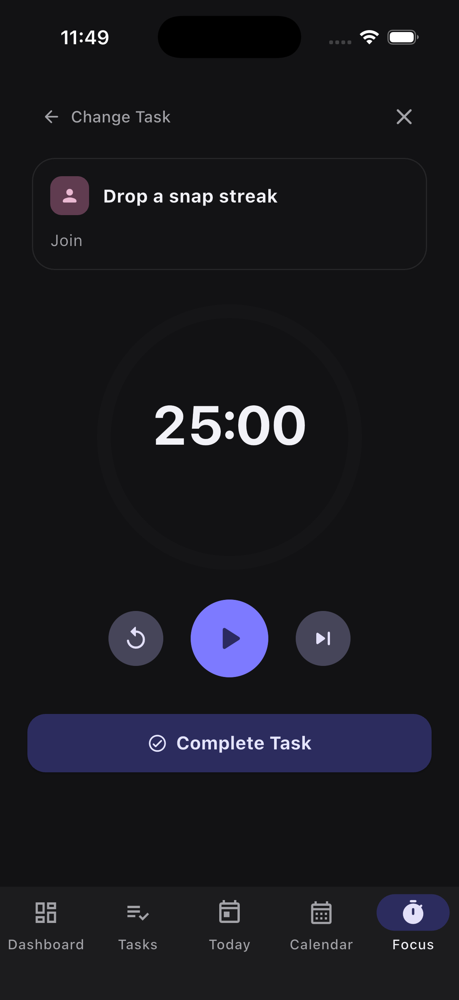

# TidyDuu 💜

[](https://github.com/j-kon/tidyduu/actions/workflows/ci.yml)
[](https://flutter.dev)
[](https://dart.dev)
[](https://flutter.dev)
[](LICENSE)

> A premium, sleek, and distraction-free task coordinator and focus dashboard built with Flutter & Dart. Formulated with Material 3 design, local-first persistence, timezone-aware notifications, and high-fidelity animations.

TidyDuu is designed as a production-quality task management tool that helps busy professionals organize their daily workflows, execute focused sessions, track completion statistics, and maintain visual progress.

---

## 🎨 Brand & Visual Showcase

Below are the screenshot showcases of TidyDuu's modern indigo-purple styling (`0xFF5E5CE6` light, `0xFF7D7AFF` dark).

### Light Mode Dashboard & Tasks
| 📊 Dashboard Insights | 📝 Tasks Grid View | ⚡ Add Task Flow |
| :---: | :---: | :---: |
| <br/>`assets/screenshots/light/dashboard.png` | <br/>`assets/screenshots/light/tasks.png` | <br/>`assets/screenshots/light/add_task.png` |

### Focus Mode & Calendar
| ⏱️ Focus Pomodoro Mode | 📅 Custom Grid Calendar | 🔔 Settings & Defaults |
| :---: | :---: | :---: |
| <br/>`assets/screenshots/light/focus_mode.png` | <br/>`assets/screenshots/light/calendar.png` | <br/>`assets/screenshots/light/settings.png` |

### Dark Mode View (OS-Adaptive)
| 🌓 Dark Mode Tasks | 🌓 Dark Mode Focus |
| :---: | :---: |
| <br/>`assets/screenshots/dark/tasks.png` | <br/>`assets/screenshots/dark/focus_mode.png` |

*Note: The images above point to placeholders in the `assets/screenshots/` directory. To update these, capture screenshots of the running app on iOS/Android emulators and place them in their respective subfolders.*

---

## 🧠 Why I Built This (Portfolio Statement)

TidyDuu was engineered to practice and demonstrate **production-grade mobile software development** using the Flutter framework. It serves as a showcase project for clean coding standards, robust architecture, and modern UX design. 

By building this application, I practiced:
*   **State Management Isolation**: Keeping UI views completely thin and declarative by using Riverpod providers for business logic, asynchronous timers, and sorting.
*   **Robust Offline-First Storage**: Implementing reliable JSON serialization with backward compatibility and fallback defaults, preventing user data corruption or crashes upon upgrades.
*   **Native Capabilities & Exact Timing**: Integrating timezone-aware notifications that schedule alarms at exact times, including subtask alerts and recurring date increments.
*   **Production-Grade CI & Verification**: Building a GitHub Actions workflow with strict lint rules, format checking, and comprehensive unit/widget testing suites ensuring zero-regression commits.

---

## 🚀 Key Features

*   **📊 Productivity Insights**: A comprehensive Dashboard compiling total, active, overdue, and today's tasks alongside streak counts and task-priority balances.
*   **⏱️ Focus Cockpit (Pomodoro)**: A focused workstation containing a Pomodoro timer (25 min focus / 5 min break) with responsive progress rings, subtask checklists, and completion alerts.
*   **📅 Custom Grid Calendar**: A custom-drawn grid calendar mapping task densities directly to calendar dates without using third-party package dependencies.
*   **🔔 Task Reminders**: Multi-option notifications (at due time, 10m, 1h, 1d before) powered by `flutter_local_notifications` that respect user timezones.
*   **🔄 Recurring Tasks & Subtasks**: Repeat tasks daily, weekly, or monthly (with auto-spawning next occurrences) and manage subtask progress bars.
*   **👉 Swipe Actions & Quick Add**: Swipe right to complete, swipe left to delete with a rapid "Undo" snackbar. Write shorthand tasks via the floating quick-add bar.
*   **🌓 Material 3 Personalization**: Smooth light/dark theme switching, default configurations, and persistent system settings.

---

## 🛠️ Technology Stack & Dependencies

*   **Framework**: [Flutter 3.x](https://flutter.dev) (Stable Channel)
*   **Language**: [Dart 3.x](https://dart.dev)
*   **State Management**: [Riverpod 2.x](https://riverpod.dev)
*   **Persistence**: [SharedPreferences](https://pub.dev/packages/shared_preferences)
*   **Notifications**: [Flutter Local Notifications](https://pub.dev/packages/flutter_local_notifications)
*   **Animations**: [Flutter Animate](https://pub.dev/packages/flutter_animate)
*   **Scheduling**: [Timezone](https://pub.dev/packages/timezone)

---

## 📁 Architecture Overview

TidyDuu uses a **feature-first, layer-separated structure** to maintain isolation and separation of concerns:

```text
lib/
├── main.dart                 # App bootstrapping, services initialization, and ProviderScope
├── models/
│   └── todo.dart             # Domain Models (Todo, Subtask, enums) and JSON serializers
├── providers/
│   ├── todo_provider.dart    # Task lists, filters, searches, and subtask mutations
│   ├── dashboard_provider.dart # Dashboard metrics, Streaks, and priorities analyzer
│   ├── focus_provider.dart   # Pomodoro countdown state, active tasks, and timers
│   └── settings_provider.dart # Settings configs (Theme preferences, defaults, storage clears)
├── theme/
│   └── app_theme.dart        # Custom light and dark Material 3 color palettes
├── services/
│   ├── storage_service.dart  # JSON serializer storage backend (SharedPreferences wrapper)
│   └── notification_service.dart # Local timezone-aware exact alarm dispatcher
├── screens/
│   ├── home_screen.dart      # Primary navigation coordinator and tab shell
│   ├── dashboard_tab.dart    # Dashboard card insights and statistics
│   ├── tasks_tab.dart        # Main lists manager with category filters and Quick Add
│   ├── today_tab.dart        # Today's prioritized cockpit and progress header
│   ├── calendar_tab.dart     # Grid-drawn custom calendar task scheduler
│   ├── focus_tab.dart        # Pomodoro session timer and checklist
│   ├── settings_screen.dart  # Theme segments, default settings, and safety tools
│   └── task_details_screen.dart # Interactive subtask checklists and detailed settings
└── widgets/
    ├── add_edit_dialog.dart  # Unified task creation/editing form
    ├── empty_state.dart      # Reusable empty states and decorative icons
    ├── filter_chips.dart     # Category selector elements
    └── todo_item_tile.dart   # Swipe gestures, metadata badges, and priority highlights
```

---

## 🎬 App Walkthrough & Demo

### Walkthrough Steps

1.  **Create a Task**: Tap the `Add Task` floating button or use the Quick Add bar at the bottom of the Tasks tab.
2.  **Add Details**: Set a title, write notes, and add subtasks to split your work.
3.  **Assign Priority & Category**: Select a priority (*Low, Medium, High*) and category tag (*Work, Study, Personal, Errands, Other*).
4.  **Schedule Alerts**: Set a due date and schedule reminders (e.g. *10 minutes before*).
5.  **Track in Today & Calendar**: Open the `Today` tab to view today's tasks and watch the progress indicator increase as you complete tasks. Open the `Calendar` tab to view days highlighted by tasks.
6.  **Execute Focus Sessions**: Open the `Focus` tab, choose a task, and start the Pomodoro timer (25 min). Check off subtasks as you work.
7.  **Monitor Insights**: Open the `Dashboard` tab to analyze completed ratios, high-priority task loads, and streak values.
8.  **Configure Preferences**: Open `Settings` to switch theme modes (System, Light, Dark), adjust defaults, and manage system permissions.

### Walkthrough Media
*   **Walkthrough Video**: *[Link to Walkthrough Video / YouTube Portfolio Video]*
*   **Interactive GIF**: *[Link to Walkthrough GIF Placeholder]*

---

## ⚙️ Getting Started

### Prerequisites
*   Flutter SDK (v3.19+ recommended)
*   Dart SDK (v3.3+ recommended)
*   Xcode (for iOS build support on macOS)
*   Android Studio / Android SDK (for Android build support)

### Quick Start Installation

1.  Clone the repository:
    ```bash
    git clone https://github.com/j-kon/tidyduu.git
    cd tidyduu
    ```
2.  Install dependencies:
    ```bash
    flutter pub get
    ```
3.  Launch the app on a connected emulator:
    ```bash
    flutter run
    ```

---

## 🧪 Testing & Verification

TidyDuu has an automated test suite containing **52 test cases** covering model serialization, storage migrations, state mutations, and widget UI interactions.

Verify formatting:
```bash
dart format --output=none --set-exit-if-changed .
```

Verify static analyze rules:
```bash
flutter analyze
```

Execute automated tests:
```bash
flutter test
```

---

## 📦 Generating Releases

### Android
Compile release APK:
```bash
flutter build apk --release
```
Compile release App Bundle (for Google Play Store):
```bash
flutter build appbundle --release
```

### iOS
Compile release bundle for App Store Connect distribution:
```bash
flutter build ios --release
```

---

## 🔮 Future Roadmap

- [ ] **Cloud Synchronization**: Real-time cross-device sync powered by Supabase or Firebase Firestore.
- [ ] **Secure Authentication**: User authentication via OAuth (Google, Apple) and email logins.
- [ ] **Task Collaboration**: Shared task lists and collaborative Pomodoro focus rooms.
- [ ] **AI Task Planner**: Dynamic timeline scheduling suggestions based on historic completion patterns.
- [ ] **Advanced Habit Metrics**: Visual heatmap calendars detailing monthly habit consistency.
- [ ] **Analytics Export**: CSV/PDF exports of task reports and focused session logs.
- [ ] **App Store Deployments**: Official distribution on Apple App Store and Google Play Store.

---

## 👤 Author

**J-Kon** - [@j-kon](https://github.com/j-kon)

---

## 📄 License

This project is licensed under the MIT License - see the [LICENSE](LICENSE) file for details.
