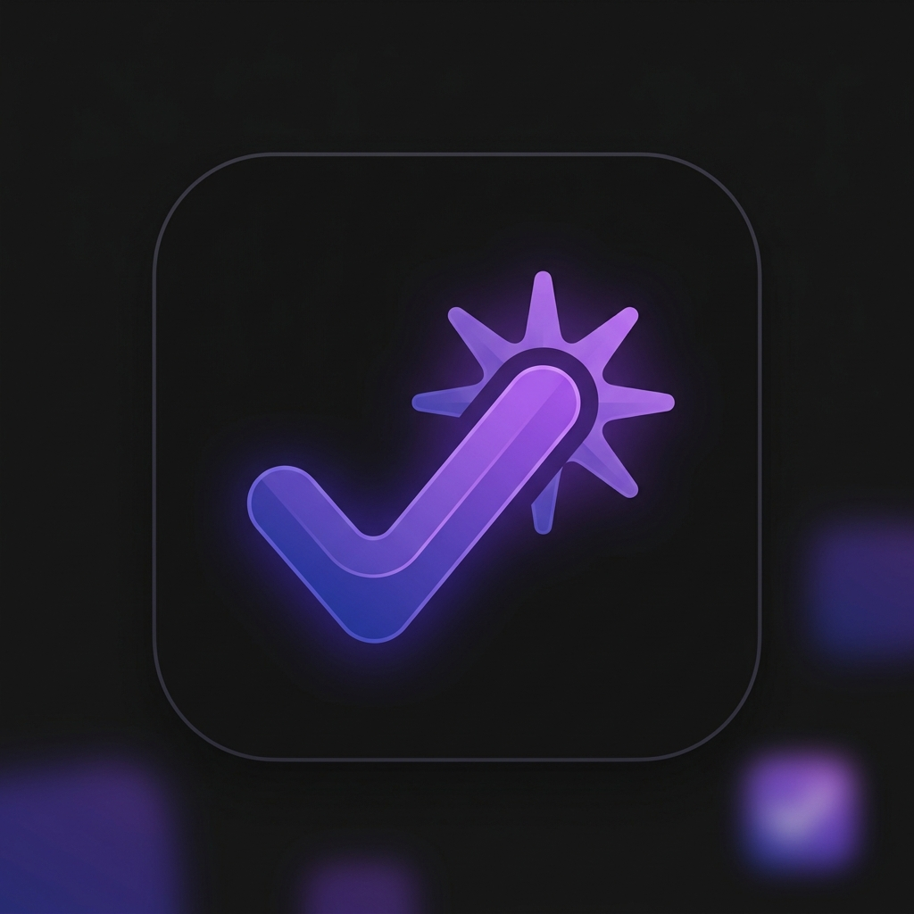

<p align="center">
  
</p>

<h1 align="center">TidyDuu</h1>

<p align="center">
  <strong>A premium, sleek, and production-ready Material 3 task management application built with Flutter.</strong>
</p>

<p align="center">
  
  
  
  
</p>

---

## 📖 Introduction

TidyDuu is a modern, distraction-free task coordinator designed for busy professionals. By prioritizing clean layouts, fluid animations, and a structured local-first data lifecycle, TidyDuu serves as a high-quality portfolio template demonstrating Flutter best practices in **Clean Architecture**, **State Management (Riverpod)**, **Platform Reminders**, and **OS-native personalization**.

---

## 🎨 Brand & UI Showcase

TidyDuu uses a signature modern indigo-purple palette (`0xFF5E5CE6` light, `0xFF7D7AFF` dark) combined with custom card contours, elevation-free layouts, and responsive components.

| Tasks Grid View (Light) | Today Focus View (Dark) | Custom Calendar View |
| :---: | :---: | :---: |
| *[Placeholder for Tasks View]*<br/>`assets/screenshots/home_light.png` | *[Placeholder for Today View]*<br/>`assets/screenshots/home_dark.png` | *[Placeholder for Calendar View]*<br/>`assets/screenshots/calendar_view.png` |

*To replace these placeholders, capture screenshots of your running app and place them in the [assets/screenshots/](assets/screenshots/) folder matching the filenames above.*

---

## 🚀 Key Features

- **📂 Smart Classification**: Group tasks instantly under *Personal, Work, Study, Errands*, or *Other* categories.
- **⚡ Priority Sorting**: Auto-arrange tasks by priority (*Low, Medium, High*).
- **📅 Custom Grid Calendar**: Visualize task volume by date on a bespoke grid calendar built using pure Flutter, avoiding dependency conflicts.
- **☀️ Today Focus**: A dedicated progress cockpit compiling tasks due today or marked for today, featuring a dynamic progress bar.
- **🔔 Task Reminders & Notifications**: Configure local alerts (At due time, 10m, 1h, 1d before) integrated with `flutter_local_notifications` and exact scheduling. Works with recurring tasks.
- **✅ Subtasks Checklist**: Split complex tasks into optional checklists with live completion progress tracking (`2/5 completed`) and indicator bars.
- **🔄 Recurring Tasks**: Automate habits with *Daily, Weekly*, or *Monthly* repeat options. Spawns next-occurrence tasks on completion.
- **📝 Task Notes**: Add optional persistence notes to your tasks, marked by card indicators.
- **👉 Swipe Actions**: Intuitive list gestures. Swipe right to toggle completion, and swipe left to delete with confirmation and instant "Undo".
- **🔍 Text Search & Multi-Filters**: Filter and search through active/completed tasks by title instantly.
- **🌓 Native Dark Theme**: Smooth OS-level light/dark theme transitions leveraging Material 3 color schemes.

---

## 📁 Clean Codebase Architecture

TidyDuu employs a feature-first, layer-separated architecture to ensure modular scalability and clear boundaries:

```text
lib/
├── main.dart                 # App initialization, services bootstrapping, & scopes
├── models/
│   └── todo.dart             # Pure data entities, subtask models, & enum extensions
├── providers/
│   └── todo_provider.dart    # Riverpod state notifiers, recurring dates, & UI filters
├── theme/
│   └── app_theme.dart        # Central light & dark Material 3 theme configurations
├── services/
│   ├── storage_service.dart  # Custom SharedPreferences JSON persistence layer
│   └── notification_service.dart # Local notifications wrapper and exact alarm Scheduler
├── screens/
│   ├── home_screen.dart      # Navigation Shell coordinates tabs
│   ├── tasks_tab.dart        # Main dashboard list tab
│   ├── today_tab.dart        # Today focus tab
│   ├── calendar_tab.dart     # Custom Grid Calendar tab
│   └── task_details_screen.dart # Interactive subtask checklist & task details view
└── widgets/
    ├── add_edit_dialog.dart  # Form dialog with notes & subtask builder
    ├── empty_state.dart      # Universal custom state widgets
    ├── filter_chips.dart     # Reusable custom filter and category chips
    └── todo_item_tile.dart   # Swipe actions, progress bars, & metadata indicators
```

---

## ⚙️ Technical Design Details

### 1. State Management (Riverpod)
TidyDuu utilizes **Riverpod 2.x** for dependency injection and state mutation:
- `todoListProvider` (backed by `TodoListNotifier`) manages the collection of todos. It coordinates persistence triggers and notifies the `NotificationService` whenever changes occur.
- Combined filtered outputs (`filteredTodoListProvider`, `todayTodoListProvider`, `calendarTodoListProvider`) calculate sorted sub-states automatically on task operations, keeping UI render trees thin and efficient.

### 2. Local-First Storage (Offline Persistence)
Local persistence is managed via `StorageService` using a `SharedPreferences` backend:
- Task structures are converted using custom `toJson` maps and stored as a JSON list.
- **Backward Compatibility**: Factory methods in `Todo` safely deserialize legacy JSON models. Missing fields (e.g., categories or reminders) default gracefully to fallback states, preventing system crashes during app updates.

### 3. Alarm Reminders & Timezone Scheduling
Reminders leverage `flutter_local_notifications` combined with the `timezone` database:
- The `NotificationService` handles native channel setups, scheduling exact alarms, and requesting runtime permission.
- Native channels are configured on Android with `SCHEDULE_EXACT_ALARM` permissions.
- In iOS, the `UNUserNotificationCenter` delegate is initialized within `AppDelegate.swift` to show notifications alerts in the foreground.

---

## 🧪 Testing & Code Quality

TidyDuu includes a comprehensive test suite targeting models, storage, state modifications, and widget trees.

### Run Static Analysis
Verify that all source files conform to standard code rules with zero errors or warnings:
```bash
flutter analyze
```

### Run Automated Tests
Execute the full unit, state provider, storage, and widget integration test suite:
```bash
flutter test
```

### Auto-Format Code
Conform project formatting to standard Dart constraints:
```bash
dart format .
```

---

## 🚀 How to Run the App

1. Ensure the Flutter SDK is installed and configured on your system path.
2. Clone this repository.
3. Fetch dependencies:
   ```bash
   flutter pub get
   ```
4. Start an Android emulator or iOS simulator.
5. Compile and launch the app in debug mode:
   ```bash
   flutter run
   ```

---

## 🔮 Future Roadmap

- [ ] **Cross-Device Cloud Sync**: Back data with Firebase Firestore or Supabase database streams.
- [ ] **Custom Tag Categories**: Let users create custom tags with custom colors and icons.
- [ ] **AI-Powered Task Prioritization**: Automatic smart ordering of tasks based on historic completions and velocity.
- [ ] **Productivity Analytics & Metrics**: Staggered graphs showing weekly and monthly task completion rates.

---

## 📄 License

This project is licensed under the MIT License. See [LICENSE](LICENSE) for details.
